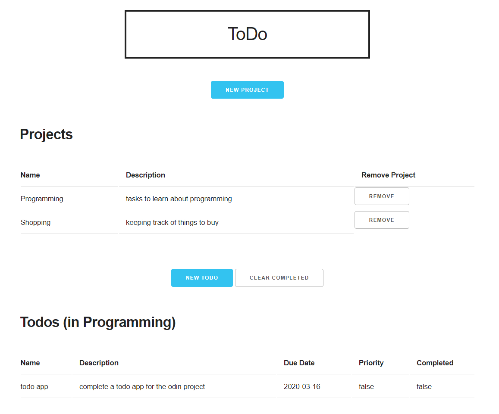

# Todo JS
 A project made for [The Odin Project](https://www.theodinproject.com/courses/javascript/lessons/todo-list)
 
 Demonstrates usage of factory functions, DOM manipulation, modules and event listeners before moving onto a framework

 Hosted [here](https://koken-y.github.io/todo/)

## Built Using
* Webpack
* Skeleton CSS
* Date-fns
* Eslint

## Features
* Click on a project to view associated todos
* Automatically sort todos according to priority then due date
* Click on a todo to toggle completion status
* [Clear Completed] deletes completed todos

